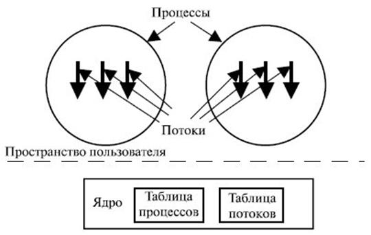
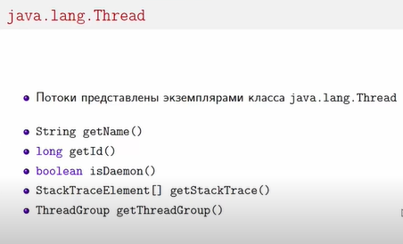
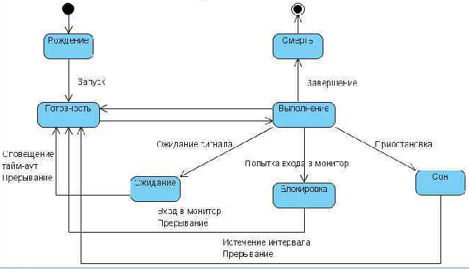
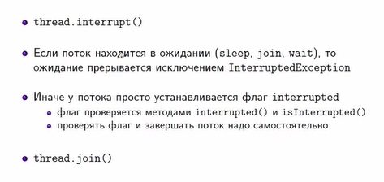
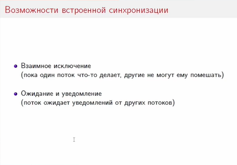
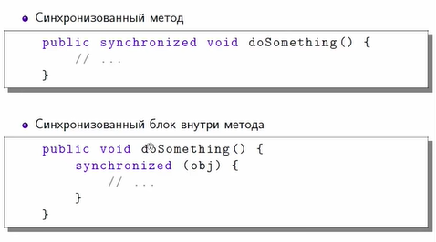
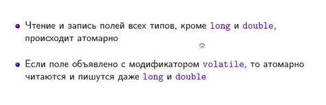
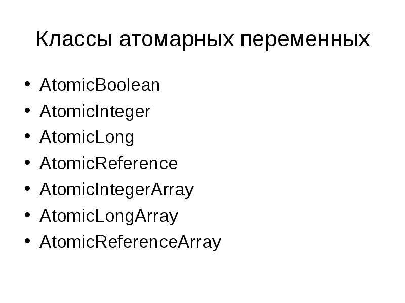
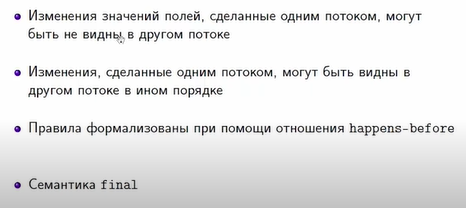
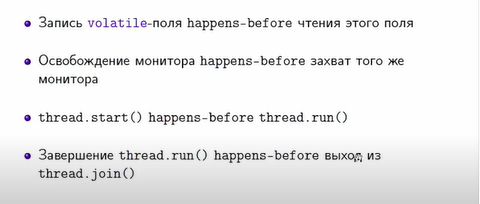

Многопоточность в Java — это выполнение двух или более потоков одновременно для максимального использования центрального процесса. 

Многопоточные приложения — это приложения, где параллельно выполняются два или более потоков.

----------------

В Java поток – это единица реализации программного кода. Последовательность данных, которая могут работать параллельно с другими своими «аналогами».
Поток отвечает за выполнение инструкций запущенного процесса, к которому он относится. Все это происходит параллельно с иными потоками этого же process. Является легковесным. Может «общаться» с другими потоками.

Процесс это некоторая единица операционной системы, которой выделена память и другие ресурсы.

# java.lang.Thread

# Жизненный цикл потока

Поток — это путь выполнения программы, который может войти в одно из пяти состояний в течение своего жизненного цикла:

1. **New** (новорожденное состояние, newborn state) возникает, когда вы создаете объект Thread в классе Thread. Поток создается и находится в “новорожденном” состоянии. То есть при возникновении потока он входит в новое состояние, но метод start() при этом еще не вызван для экземпляра.

2. **Runnable.** Это состояние означает, что поток готов к выполнению. Когда метод start() вызывается для нового потока, он становится готовым к запуску. В данном состоянии поток ожидает, пока процессор не станет доступным (CPU time, процессорное время). То есть поток становится в очередь (серию) потоков, ожидающих выполнения.

3. **Running** (состояние выполнения). Выполнение означает, что процессор выделил временной интервал для выполнения потока. Это состояние, в котором поток выполняет свою фактическую функцию.

4. **Blocked** (заблокированное состояние). Поток находится в заблокированном состоянии, когда он приостанавливается, спит или ждет некоторое время, чтобы удовлетворить поставленное условие.

5. **Dead State.** Это состояние возникает, когда метод run() завершает выполнение инструкций. Поток автоматически останавливается или переходит в мертвое состояние (Dead State). Иными словами, когда поток выходит из метода run(), он либо завершается, либо переходит в состояние dead.

Существует две реализации многопоточного приложения: 
- (implementing) интерфейса Runnable 
- расширение(extending) класса Thread. 

Расширение класса - это путь наследования методов и переменных класса родителя. В этом случае можно наследоваться только от одного родительского класса Thread. Данное ограничение внутри Java можно преодолеть реализацией интерфейса Runnable, который является наиболее распространённым способом создания потоков.

В классе Thread определены семь перегруженных конструкторов, большое количество методов, предназначенных для работы с потоками, и три константы (приоритеты выполнения потока).
Наиболее часто используемые методы класса Thread для управления потоками :

long getId() - получение идентификатора потока;
String getName() - получение имени потока;
int getPriority() - получение приоритета потока;
State getState() - определение состояния потока;
void interrupt() - прерывание выполнения потока;
boolean isAlive() - проверка, выполняется ли поток;
boolean isDaemon() - проверка, является ли поток «daemon»;
void join() - ожидание завершения потока;
void join(millis) - ожидание millis милисекунд завершения потока;
void notify() - «пробуждение» отдельного потока, ожидающего «сигнала»;
void notifyAll() - «пробуждение» всех потоков, ожидающих «сигнала»;
void run() - запуск потока, если поток был создан с использованием интерфейса Runnable;
void setDaemon(bool) - определение «daemon» потока;
void setPriority(int) - определение приоритета потока;
void sleep(int) - приостановка потока на заданное время;
void start() - запуск потока.
void wait() - приостановка потока, пока другой поток не вызовет метод notify();
void wait(millis) - приостановка потока на millis милисекунд или пока другой поток не вызовет метод notify(

Демон в широком значении – фоновая программа. В Java потоки-демоны имеют схожий смысл: это потоки для фоновых действий по обслуживанию основных потоков. Потоки не-демоны называются пользовательскими (user thread). Тред создается демоном, если его родитель демон. Свойство Java-треда isDaemon можно переключать в любой момент до старта потока.

    public static void main(String []args){
        Thread currentThread = Thread.currentThread();
        ThreadGroup threadGroup = currentThread.getThreadGroup();
        System.out.println("Thread: " + currentThread.getName());
        System.out.println("Thread Group: " + threadGroup.getName());
        System.out.println("Parent Group: " + threadGroup.getParent().getName());
    }

У потоков есть свой обработчик исключений

    public static void main(String []args){

            Thread th = Thread.currentThread();
            th.setUncaughtExceptionHandler(new Thread.UncaughtExceptionHandler() {
                @Override
                public void uncaughtException(Thread t, Throwable e) {
                    System.out.println("Возникла ошибка: " + e.getMessage());
                }
            });
            System.out.println(2/0);

    }
    
Простой пример создания многопоточного приложения:

        public static class MyThread extends Thread {
            @Override
            public void run() {
                System.out.println("Hello, World!");
            }
        }

        public static void main(String []args){
            Thread thread = new MyThread();
            thread.start();
        }

Вариант с потомком от Thread плох уже тем, что мы в иерархию классов включаем Thread. Второй минус — мы начинаем нарушать принцип "Единственной ответственности" SOLID, т.к. наш класс становится одновременно ответственным и за управление потоком и за некоторую задачу, которая должна выполняться в этом потоке.

Рекомендуемые вариант:

        public static void main(String []args){
            Runnable task = new Runnable() {
                public void run() {
                    System.out.println("Hello, World!");
                }
            };

            Thread thread = new Thread(task);
            thread.start();

        }

# Прерывание потоков

# Всем спать (засыпание потоков)

В операционной системе, на которой установлена виртуальная Java машина, где выполняется Java код, есть свой планировщик потоков, называемый Thread Scheduler

Thread.sleep(2000); - задержит выполнение программы на 2 секунды

            for (int i = 10; i > 0; i--)
            {
                System.out.println(i);
                Thread.sleep(1000);
            }

# WAIT и NOTIFY

Метод wait () — переводит вызывающий поток в состояние ожидания. В этом случае вызывающий поток освобождает монитор, который имеет доступ к ресурсу. Ожидание продолжается до тех пор, пока другой поток выполнения, который вошел в монитор, не вызовет метод notify ().

Метод notify. public final void notify (). Пробуждает один поток, который ожидает на мониторе этого объекта. Если какие-либо потоки ожидают этого объекта, один из них выбирается для пробуждения. Выбор является произвольным и происходит на усмотрение реализации. Поток ожидает на мониторе объекта, вызывая один из методов wait.

# Проблемы многопоточности:

- Понятие условий гонки
Несколько потоков одновременно обращаются к одному и тому же ресурсу и выполняют операции чтения и записи., Прежде чем один из потоков должен выполнить операцию, основанную на состоянии переменной, переменная может быть изменена другими потоками

- Взаимная блокировка (DEADLOCK)
Deadlock — это программа, в которой все параллельные процессы ожидают друг друга.

- Голодание потоков
Голодание-это когда среда выполнения Java (JVM) не выделяет время на выполнение потока.

# Синхронизация потоков

Синхронизация – выполнение параллельных потоков в приложении синхронно. Способствует избеганию ошибок согласования памяти.

Разница между синхронизированным ключевым словом и блоком

Синхронизация метода - синхронизирует доступ в метод для всех потоков
Сихронизация блока - позволяет синхронизировать блок, давая возможность выполнять потокам другие действия в методе

Для решения проблемы состояния гонки можно использовать ключевое слово volatile, которое применимо только для полей объекта, но не для локальных переменных. Это связано с тем, что мы не делим их (не используем одновременно) между разными потоками в отличие от полей.
Если поле является final, то в volatile нет необходимости. Это происходит потому, что final-поля никогда не меняются, а значит не могут создать озвученных ранее проблем.
Также нужно иметь в виду, что если ссылка на объект используется в качестве поля и является volatile, то это не означает, что содержимое объекта также является volatile.

**Преимущества использования volatile:**

- Поток всегда считывает данные из основной памяти
- Процессор никогда не кэширует значения, что исключает возникновения проблемы видимости
- Компилятору сообщается, что значение переменной может быть изменено в любое время и разделено между несколькими потоками, поэтому ему рекомендуется не оптимизировать его, что предотвращает возникновение состояния гонки

Хотя ключевое слово volatile может быть хорошим решением, его чрезмерное использование может вызвать проблемы, т. к. оно запрещает кэширование данных процессором, что, безусловно, снижает производительность программы и препятствует дальнейшей оптимизации.

Поэтому нужно быть осторожными при его использовании и применять только там, где это действительно необходимо, а не подряд для всех полей.

Java Atomic Types - это простые переменные типы, которые обеспечивают основные операции, которые являются потокобезопасными и атомными, не прибегая к блокировке.

# Happens-before

